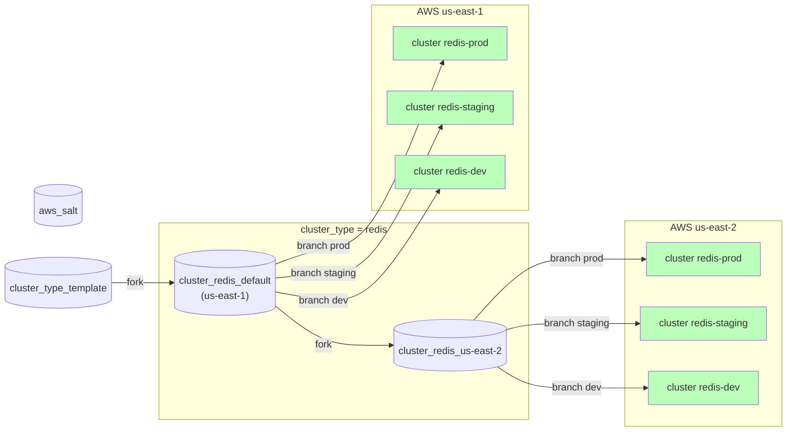

See [TODO](todo.md) for things I'm still working on with this!

# Overview
What I want to do here is come up with a way to leverage packer, terraform, and salt to build infrastructure on AWS.

# Repositories
The repository `aws-salt` (this repository) contains the terraform module and helper scripts (e.g., packer build).

There is an ultimate upstream repository [cluster-type-template](https://github.com/lago-morph/cluster-type-template) from which cluster-type repositories should be forked.

For each cluster-type, there is one upstream repository forked from repo `cluster-type-template`, which targets the region you are doing development in for that type of cluster.  For additional regions, you will fork the cluster-type repo.

## Repository diagram



So a "cluster" is a cluster-type repository (potentially forked with the
region redefined), plus a branch of that repository.  There cannot be multiple
clusters with different names with the same repo and branch.  Just create a
new branch in the git repository if you want another cluster with an identical configuration.

The cluster name is (cluster-type)-(branch-name), and must be unique by region
and account.

For convenience we will store the terraform state in the git repository with each cluster-repo and branch.  This can be easily overridden if you want remote state, e.g. in an S3 bucket (there is a target in terraform/Makefile in the template repository to do this for you).

# Instantiation instructions
For example, say I'm interested in making a redis cluster.  Here is the sequence of steps I would follow:
1. Fork [cluster-type-template](https://github.com/lago-morph/cluster-type-template) to a new repository called `cluster-redis-default`.
2. Create a new ssh key pair or use an existing one for access to the `cluster-redis-default` git repo.  For instance, on GitHub you would add the public key as a "deploy key" for the repository.
3. Clone your new repository to your local system.
4. Clone [aws-salt](https://github.com/lago-morph/aws-salt) to your local system.
5. Configure your AWS CLI to access your account and the region in which you plan to deploy the cluster.
6. cd `aws-salt/packer`, and type `packer init .` followed by `packer build .` to build the AMIs.  This takes 10-15 minutes, so do it early so you can do the rest of the setup while waiting.
  - If for some reason you need to build just one of the AMIs (minion or master):
    - `packer build -only=minion-build.amazon-ebs.ubuntu-20-04-amd64 .`
    - `packer build -only=master-build.amazon-ebs.ubuntu-20-04-amd64 .`
7. In the file `cluster-redis-default/cluster-type.json`, set "cluster_type" to redis, "repository_source" to the ssh-accessible URL for the `cluster-redis-default` repository, then set your region and a reference to the private key file on your local machine that can access the repo read-only (e.g., GitHub deploy key or equivalent).
8. In the file `cluster-redis-default/cluster.json` file, create records for each type of host you want in the cluster, the number to create, and if it should be on the public IP subnet of the VPC.  If you define any of the public IP options as false, you will probably want to enable a NAT gateway for things like software installs to work on those machines.  To do that set the option `enable_nat_gateway = true` in the aws-cluster-module module block.
9. Add the ssh private key from step 2 in the AWS SSM paramter `/<type>-<branch>/private_key`.  E.g., for cluster type `redis`, instantiated from branch `main`, you need to populate the SSM parameter `/redis-main/private_key`.  There is a script in `cluster-type-template/scripts/set-private-key.sh` that will set this parameter if the private key file is on your local filesystem and you've configured the location in `cluster-type.json`.  You can also populate this parameter using the AWS web console or AWS CLI.
10. change directory to `cluster-redis-default/terraform`, and type `make init` followed by `make apply-auto-approve` to build your cluster.  This will create a cluster with name `redis-master` or `redis-main`, depending on your default branch name.
11. Make sure to commit the terraform state files in `cluster-redis-default/terraform` into your git repository.  They will have different names depending on the branch you are using, but probably just add anything with the suffix `.tfstate` to git.  The Terraform state files need to be saved as long as your cluster is running so that Terraform can be smart about small changes (e.g., changing the cluster.json file and re-applying).
12. Once the cluster has been created, you can ssh to the salt-master by being in the directory `cluster-redis-default/terraform` and typing `make ssh-master`.  Follow the (for now) manual procedure below to get the cluster configured.
13. You can create other clusters in different branches with different configurations by creating a new git branch, changing cluster.json, and following along again from step 8.  The Makefile will automatically use terraform workspaces named after the branch so the state files will not overwrite each other or cause problems when merging changes.

To instantiate a cluster in another region (e.g., `us-east-2`), fork `cluster-redis-default` to another repo named `cluster-redis-us-east-2`.  Clone this repo, change the region and repository_source in cluster-type.json, check out the branch in the repo you want to build the cluster for, delete the state files from the cloned repo, configure AWS CLI to use us-east-2, and follow along from step 8 above.  The naming standard to use `default` as the region name for the first repo is just so it is easier to see which one is the upstream for the other ones, so you can make changes there that need to propagate to the other regions.

## Initial saltstack run
This is manual for now, it will be automated as a todo.

This sequence must be done at cluster start and any time you change the instances in the cluster (by modifying `cluster.json` and re-applying the terraform configuration).
1. Log into the salt master with `make ssh-master` from your template terraform directory.
2. Build the inventory from AWS tags of running instances with `sudo /opt/gitrepo/scripts/build_nodes.sh`. 
3. Recognize the keys from the salt minions with `sudo -u salt salt-key -A --yes`.  The security group is set up such that the only hosts that can try to register are the hosts in the cluster.
4. Look at the generated state from saltclass with `sudo -u salt salt '*' state.show_top`.  
5. Apply the state with `sudo -u salt salt '*' state.apply`
6. If you are using the default configuration, you should be able to query the webserver with `curl webserver-0` and get the response "Hello!".

# Configuration files
Repo cluster-type-template has (in root of repo)
```
cluster-type.json
{ "cluster_type": <cluster-type-name>,  (e.g., "redis") (override when forking template)
  "repository_source": <whatever.git>, (e.g., "git@github.com:lago-morph/cluster-type-template.git")
  "region" : <region>, (e.g., us-east-1) (overwrite when forking cluster-<type>-default)
  "private_key_file" : <filename> (e.g., ~/secrets/default-ro-key)
}
```
Make sure repository_source matches the name of the new repository or you will
be sad (this is not checked!)

Don't store private_key_file in repository directory structure!

cluster.json (potentially different for each branch)
```
{ 
  "hostclass": 
    [
       {
         "class_name": <saltclass1>,
	     "num_hosts": <num>,
	     "public_ip": <true/false>
       },
       {
         "class_name": <saltclass2>,
	     ...
       },
       ...
    ]
}
```
